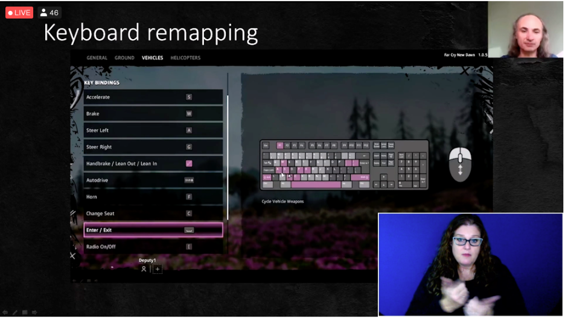
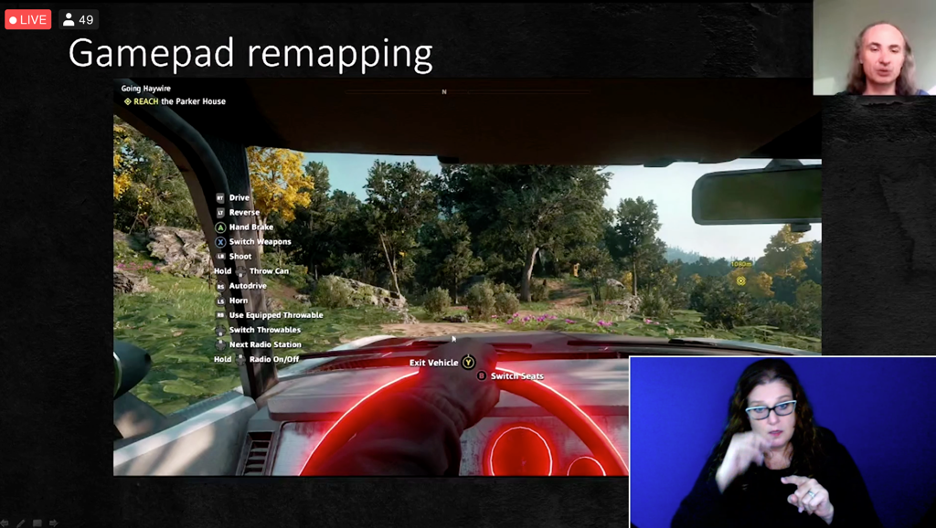
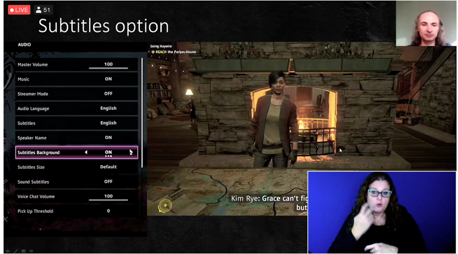
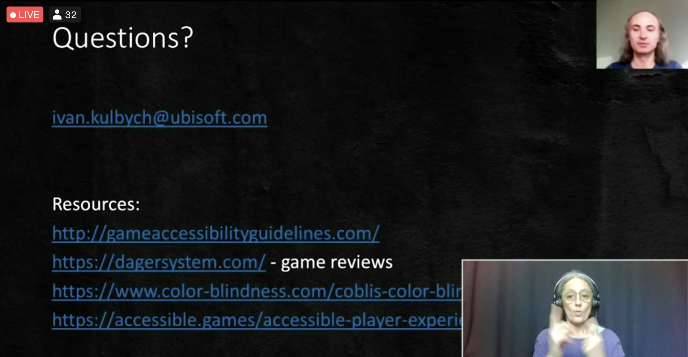

# Evolution Of Accessibility In Far Cry
Speaker: Ivan Kulbych  
[@Ubisoft](https://twitter.com/Ubisoft)

- 253 million people live with visual impairment
- 70% of ACO (Assassins Creed Odyssey) players played with Subtitles
- If you have any type of chat on your game, it should be CVAA compliant
- FC5 accessibility was really low. 
- FC New Dawn
    - Control Remapping
    - Color blind mode
    - Subtitles improved (size, speaker, background)
    - SFX visualization
    - Voice to Text
    - Menus narrator (text to voice)
    - Chat Wheel

## Keyboard remapping
- Should be standard in every game
- Keyboard image with button remapping

- Screen feedback

- Colorblind options
    - Can set this option to improve visual for most colourblindness
- Subtitles option

- Screen Reader allowed for Menu narration & Chat wheel
- Scaling Closed Captions
- Scaling HUD

## Accessibility Testing
- UX lab @Bucharest
    - Checklist
    - Accessibility standards
- Accessibility Experts
    - Workshops for the team
    - Testing the early build & recommendations
- User testing
    - Game needs to be almost final

## Far Cry 6 Accessibility
- Customize Colour Blind Palette

- Keyboard remapping: using 1 or 2 buttons at the same time

## Resources
- [http://gameaccessibilityguidelines.com/](http://gameaccessibilityguidelines.com/)

- [https://dagersystem.com](Accessibility Games Reviews)
- [https://www.color-blindness.com/coblis-color-blindness-simulator/](https://www.color-blindness.com/coblis-color-blindness-simulator/)
- [https://accessible.games/accessible-player-experiences/](https://accessible.games/accessible-player-experiences/)