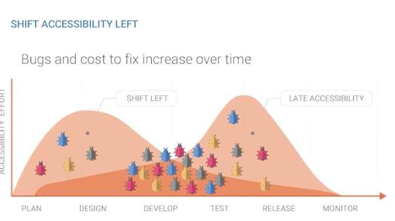
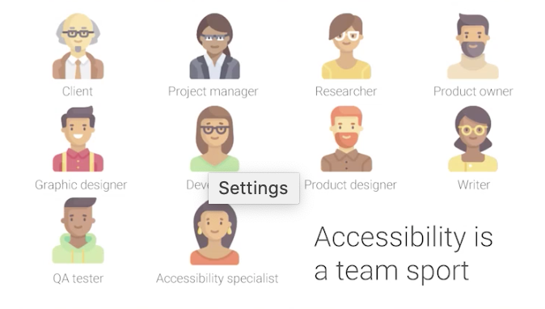

# How I’m Building A Pro-Accessibility Culture At Canada Post
Speaker: Kate Kalcevich
Twitter: [@katekalcevich](https://twitter.com/katekalcevich)
[Slides](https://docs.google.com/presentation/d/1KWe_QX0vk23nvEe73NHiirnuxtCWvihJs2QbWHvKuyo/edit?usp=sharing)

- How we design shapes our perspective on disabilities
- "Culture eats strategy for breakfast"
- Canada Post is going through a digital transformation
- How Canada Posts sees a11y:
    - Workforce 
    - Physical environment
    - Good & Services
    - Design & Deliver digital products
- "Culture comes from shared learning. People working together to solve problems and figuring out what works."
- DoD need to be WCAG2.1 compliant, any exemptions go through a11y team
- Comprehensive Testing
    - Perceived a11y
    - Perceived ease of use
    - Task completion
- Shift accessibility left

## Concrete Culture steps
1. Demonstrate how to use AT
2. Create opportunities to interact with people with disabilities
3. Pair design & program, collaborate & problem solve a11y

## A11y program
1. Executive Support
2. Funding Program
3. Process Change

- How to get executive support: show how people with disabilities use your website/products
- Prioritize projects in progress

## Tools
- Wave, Axe, Lighthouse during build
- Manual test during QA

## Accessibility Roles
- We all have a role to play

## Design System
- Canada Post design system: [https://canadapost.design/en/mercury/home.page](https://canadapost.design/en/mercury/home.page)

## Digital product targets
- Target 80% or higher
- 100% task completion

## Resources
- Inclusive Components by Heydon Pickering
- The Power of myth, Inclusive Components
- The body by Bill Bryson
- [Canada Post Design System](https://canadapost.design/en/mercury/home.page)